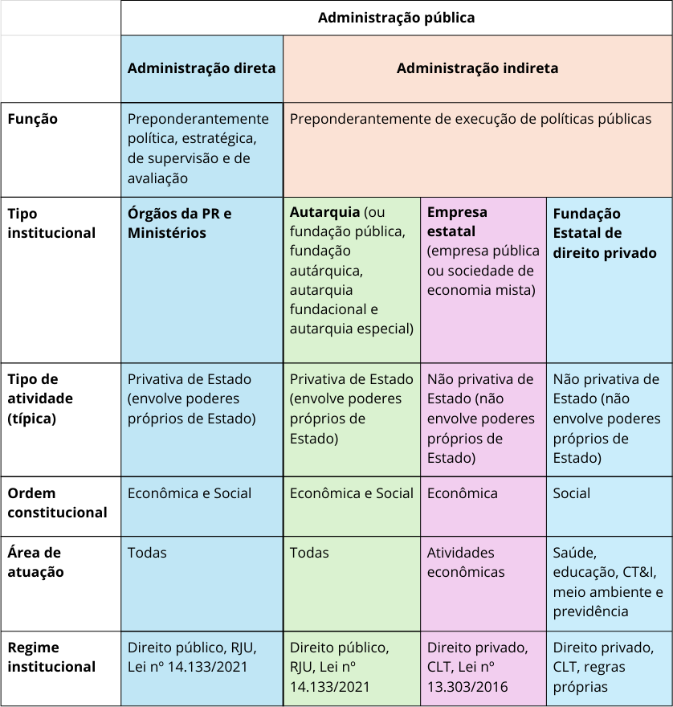
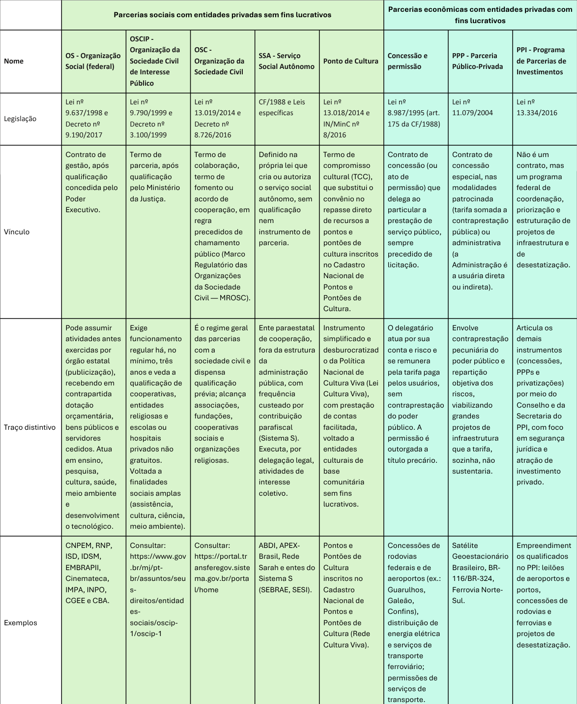

Organização da Administração Pública Federal
============================================

.. admonition:: Sobre este capítulo

   Neste capítulo, você compreenderá como a Administração Pública Federal se organiza
   para implementar políticas públicas. Você verá desde o desenho de suas estruturas
   próprias até as estratégias de articulação com a sociedade civil, por meio de
   parcerias, para a entrega de serviços de qualidade aos cidadãos.

O Estado é a instituição jurídica consubstanciada na Constituição e na regulamentação
infraconstitucional. O Estado brasileiro é uma república democrática com organização
federativa, integrado pelos Poderes Legislativo, Executivo e Judiciário, compreendendo
a União, os Estados, o Distrito Federal e os Municípios.

Na qualidade de Estado Democrático de Direito, a Constituição preconiza a igualdade
política, o acesso à informação, bem como o direito à participação e ao controle dos
cidadãos nos processos de formulação, implementação e avaliação de políticas públicas.

A Administração Pública é regulada pelo art. 37 da `Constituição Federal <https://www.planalto.gov.br/ccivil_03/constituicao/constituicao.htm>`_. Do
ponto de vista jurídico, a doutrina a define sob dois aspectos principais
:cite:`di_pietro_2021`:

* **Sentido material ou objetivo:** A atividade concreta e imediata que o Estado
  desenvolve, sob regime jurídico total ou parcialmente público, para a consecução
  dos interesses coletivos.
* **Sentido subjetivo ou formal:** O conjunto de órgãos e de pessoas jurídicas aos
  quais a lei atribui o exercício da função administrativa do Estado.

O conjunto de órgãos e entidades que integram a administração pública é dinâmico,
adaptando-se às necessidades de implementação e às linhas programáticas do governo eleito.

O art. 84 da `Constituição Federal <https://www.planalto.gov.br/ccivil_03/constituicao/constituicao.htm>`_ estabelece a competência privativa do Presidente da República para
dispor sobre a organização e o funcionamento da administração federal, desde que não
implique aumento de despesa nem a criação ou extinção de órgãos públicos. Diante das
transformações políticas e tecnológicas, essas estruturas são constantemente
aperfeiçoadas para garantir a eficiência da ação estatal.

O `Decreto-Lei nº 200, de 1967 <https://www.planalto.gov.br/ccivil_03/constituicao constituicao.htm>`_, parcialmente vigente, classifica os órgãos e as
entidades da administração federal em dois grandes blocos: a **administração direta**
e a **administração indireta**.

Administração direta
--------------------

Na organização da administração pública federal direta, a Presidência da República
atua como o órgão independente do Poder Executivo da União, centralizando as atividades
administrativas superiores de âmbito federal, de política, planejamento, coordenação e
controle do desenvolvimento socioeconômico do País e da segurança nacional
:cite:`meirelles_2016a`. Nesse sentido, a administração direta exerce uma função
predominantemente estratégica, focada na formulação, supervisão e avaliação de políticas
públicas.

Os Ministérios são órgãos autônomos situados logo abaixo da Presidência da República.
Eles integram os serviços da Administração Direta e supervisionam as entidades da
administração indireta cujas atividades se enquadrem nas suas respectivas áreas de
competência (salvo as exceções integradas ou vinculadas diretamente à Presidência)
(Ibidem, p. 649).

A organização básica dos órgãos da Presidência da República e dos Ministérios é
estabelecida em lei específica, atualmente a `Lei nº 14.600, de 19 de junho de 2023 <https://www.planalto.gov.br/ccivil_03/_ato2023-2026/2023/lei/l14600.htm>`_. Essa legislação
define as macrocompetências de cada pasta, as quais são posteriormente detalhadas nos
respectivos decretos de estrutura regimental ou estatuto. Assim, enquanto a lei traz a
organização básica geral, os decretos especificam o funcionamento de cada órgão,
detalhando o quadro de cargos e funções.

Administração indireta
----------------------

A administração indireta tem como função principal a execução de políticas públicas e
é integrada por entidades dotadas de personalidade jurídica própria, autonomia
administrativa e funcional, vinculadas aos fins definidos em suas leis de criação.

A administração indireta compreende:

1. **Entidades estatais de direito público:** Autarquias e fundações públicas
   (incluindo as fundações autárquicas e autarquias fundacionais).
2. **Entidades estatais de direito privado:** Empresas estatais e fundações
   instituídas pelo poder público com personalidade jurídica de direito privado.

A vinculação dessas entidades aos órgãos da administração direta é estabelecida por
ato do Poder Executivo federal, atualmente disposta no `[inserir link para o decreto]`.

.. note::
   Caso a proposta de alteração da estrutura regimental de um Ministério inclua ou
   remova a vinculação de uma entidade, o respectivo Decreto de estrutura deverá
   prever a devida alteração ou revogação no decreto de vinculação vigente.

Autarquia e fundação pública
++++++++++++++++++++++++++++

Trata-se da pessoa jurídica de direito público, criada por lei específica, para prestar
serviços públicos ou executar atividades administrativas que exijam poderes próprios
de Estado.

.. important::
   A descentralização de atividades pode ocorrer em dois planos distintos:

   * **Dentro da administração pública** — por meio de entidades com personalidade
     jurídica própria, como autarquias, fundações públicas ou empresas estatais.
   * **Fora da administração pública** — por meio de parcerias com a sociedade
     civil, como organizações sociais e OSCIPs.

A opção pela descentralização — seja para dentro ou para fora da administração —
costuma basear-se nos mesmos objetivos estratégicos de gestão:

* **Especialização:** Permite que estruturas focadas lidem com setores técnicos
  complexos com maior expertise do que o governo central.
* **Descentralização:** Aproxima a prestação dos serviços públicos das realidades
  locais, melhorando a responsividade regional.
* **Flexibilidade administrativa:** A autonomia financeira e administrativa confere
  agilidade na tomada de decisões e na adaptação a cenários dinâmicos.
* **Redução da burocracia:** Simplifica o fluxo decisório ao evitar que demandas
  operacionais sobrecarreguem o núcleo central do governo.
* **Responsabilização:** Estruturas de governança próprias, como diretorias
  colegiadas, aumentam a transparência e aproximam o órgão do controle social.
* **Captação de recursos:** Confere capacidade legal de gerar receitas próprias
  por meio de taxas e tarifas — embora, na esfera federal, esse impacto seja
  mitigado pela centralização da arrecadação da União.

Autarquias de regime especial
+++++++++++++++++++++++++++++

As autarquias de regime especial são aquelas às quais a Constituição ou a lei outorgou
maior grau de autonomia. Suas prerrogativas típicas incluem a garantia de mandato fixo
e estabilidade para seus dirigentes, além da impossibilidade de revisão de seus atos
técnicos pela administração direta, ressalvada a atuação do Poder Judiciário.

São exemplos consolidados as agências reguladoras e o Banco Central do Brasil.

Empresa estatal
+++++++++++++++

É a entidade dotada de personalidade jurídica de direito privado e fins econômicos,
cuja maioria do capital votante pertença, direta ou indiretamente, à União. Sua atuação
volta-se à prestação de serviços públicos ou à exploração de atividade econômica
(Art. 2º, I do Decreto nº 8.945/2016).

Sua criação depende de autorização legislativa e é efetivada por Decreto do Poder
Executivo por razões de segurança nacional ou relevante interesse coletivo. Essa
entidade pode assumir duas configurações jurídicas:

Sociedade de economia mista
^^^^^^^^^^^^^^^^^^^^^^^^^^^
Explora atividade econômica sob a forma de sociedade anônima (S.A.), permitindo a
participação de capital privado, desde que a maioria das ações com direito a voto
permaneça com a União (Art. 2º, III do Decreto nº 8.945/2016).

Empresa pública
^^^^^^^^^^^^^^^
Seu capital social é constituído por recursos provenientes exclusivamente do setor
público, admitindo-se a participação de outros entes da administração, desde que a
maioria do capital votante continue com a União (Art. 2º, II do Decreto nº 8.945/2016).

A relação atualizada das empresas estatais federais está disponível no portal da
Secretaria de Coordenação e Governança das Empresas Estatais (SEST):
`Estatais <https://www.gov.br/gestao/pt-br/assuntos/estatais>`_.

Fundação instituída pelo poder público de direito privado
^^^^^^^^^^^^^^^^^^^^^^^^^^^^^^^^^^^^^^^^^^^^^^^^^^^^^^^^^

O Decreto-Lei nº 200, de 1967 (com redação dada pela Lei nº 7.596/1987), define-a como
entidade sem fins lucrativos, dotada de personalidade jurídica de direito privado,
criada por autorização legislativa para o desenvolvimento de atividades que não exijam
execução por órgãos de direito público. Conta com autonomia administrativa, patrimônio
próprio e funcionamento custeado por recursos da União e de outras fontes.

De acordo com o inciso XIX do art. 37 da Constituição Federal de 1988, a instituição
de fundação é autorizada por lei, cabendo à lei complementar a definição das suas áreas
de atuação. O Supremo Tribunal Federal chancelou a constitucionalidade desse modelo
(ADI nº 4.197 SE).

Na :numref:`ADM-direta-indireta` há uma visualização **idealizada** dos tipos
institucionais correlacionados com suas funções, atividades e áreas de atuação.

.. _ADM-direta-indireta:

   Visão idealizada dos tipos institucionais da APF

..
   .. list-table::
      :header-rows: 1
      :widths: 18 22 22 22 16

      - *
        * Administração direta
        * Autarquia (ou fundação pública, fundação autárquica, autarquia fundacional e autarquia especial)
        * Empresa estatal (empresa pública ou sociedade de economia mista)
        * Fundação Estatal de direito privado
      - * Função
        * Preponderantemente política, estratégica, de supervisão e de avaliação
        * Preponderantemente de execução de políticas públicas
        * Preponderantemente de execução de políticas públicas
        * Preponderantemente de execução de políticas públicas
      - * Tipo institucional
        * Órgãos da PR e Ministérios
        * Autarquia (ou fundação pública, fundação autárquica, autarquia fundacional e autarquia especial)
        * Empresa estatal (empresa pública ou sociedade de economia mista)
        * Fundação Estatal de direito privado
      - * Tipo de atividade
        * Privativa de Estado (envolve poderes próprios de Estado)
        * Privativa de Estado (envolve poderes próprios de Estado)
        * Não privativa de Estado (não envolve poderes próprios de Estado)
        * Não privativa de Estado (não envolve poderes próprios de Estado)
      - * Ordem constitucional
        * Econômica e Social
        * Econômica e Social
        * Econômica
        * Social
      - * Área de atuação
        * Todas
        * Todas
        * Atividades econômicas
        * Saúde, educação, CT&I, meio ambiente e previdência
      - * Regime institucional
        * Direito público, RJU, Lei nº 14.133/2021
        * Direito público, RJU, Lei nº 14.133/2021
        * Direito privado, CLT, Lei nº 13.303/2016
        * Direito privado, CLT, regras próprias

.. note::
   Por razões históricas, existem desconformidades na alocação de certas atividades na
   administração pública federal. Há funções finalísticas da área social sendo executadas
   diretamente por ministérios ou empresas estatais, bem como autarquias desempenhando
   papéis que não demandam poder de império. Esse descompasso institucional gera
   restrições e controles inadequados ao tipo de atividade, afetando negativamente o
   desempenho institucional. Portanto, propostas de reestruturação devem buscar
   continuamente a correção desse modelo.

.. important::
   A execução das políticas públicas não ocorre exclusivamente por meio das estruturas
   internas do Poder Executivo Federal. Além da descentralização federativa (para estados
   e municípios), o poder público atua em estreita cooperação com entidades da sociedade
   civil. Assim, ao desenhar a estratégia de implementação de uma política, os gestores
   públicos devem sempre considerar os arranjos de parceria como alternativas viáveis à
   criação de novas estruturas estatais.

Parcerias
---------

Uma parcela expressiva das políticas públicas federais é operacionalizada por meio de
parcerias com entidades privadas, com ou sem fins lucrativos.

Essa estratégia de descentralização traz vantagens relevantes para a administração:

* **Eficiência operacional:** Aproxima o processo decisório dos beneficiários finais,
  conferindo respostas ágeis e desburocratizadas.
* **Inovação e adaptação local:** Garante flexibilidade para adaptar os programas
  governamentais às peculiaridades regionais.
* **Participação cívica:** Fortalece o controle social e estimula o engajamento direto
  da comunidade na execução do serviço público.
* **Responsabilização:** Vincula o repasse de recursos públicos ao cumprimento de metas
  claras de desempenho.
* **Redução de desigualdades:** Permite concentrar esforços e recursos em áreas
  vulneráveis com maior precisão.

A :numref:`Parcerias-label` apresenta os principais instrumentos jurídicos de parceria
utilizados pela União.

.. _Parcerias-label:

   Principais instrumentos de parceria com o setor privado

..
   .. list-table::
      :header-rows: 1
      :widths: 15 17 17 17 17 17

      - * Nome
        * Organização Social (OS)
        * Organização da Sociedade Civil de Interesse Público (OSCIP)
        * Organização da Sociedade Civil (OSC)
        * Parceria Público-Privada (PPP)
        * Serviço Social Autônomo (SSA)

      - * Legislação
        * Lei nº 9.637/1998 e Decreto nº 9.190/2017
        * Lei nº 9.790/1999 e Decreto nº 3.100/1999
        * Lei nº 13.019/2014 e Decreto nº 8.726/2016
        * Lei nº 11.079/2004
        * CF/1988 e Leis Específicas

      - * Escopo
        * Entidades de direito privado, sem fins lucrativos, com atividades dirigidas ao ensino, à pesquisa científica, ao desenvolvimento tecnológico, à proteção do meio ambiente, à cultura e à saúde.
        * Pessoas jurídicas de direito privado sem fins lucrativos em funcionamento regular há, no mínimo, três anos, cujos objetivos sociais estejam alinhados às finalidades estipuladas na lei (ex: assistência social, combate à pobreza).
        * Organizações da sociedade civil (ONGs), sociedades cooperativas e organizações religiosas que desenvolvam atividades de interesse público e cunho social.
        * Contratos de concessão que permitem o uso eficiente de recursos privados para a prestação de serviços complexos ou entrega de grandes infraestruturas, mediante divisão calibrada de riscos contratuais.
        * Entidades civis de direito privado instituídas por lei. O "Sistema S" (SESI, SENAI, SEBRAE) foca no ensino ou assistência a categorias profissionais. Outras entidades (APEX, ABDI, Rede Sarah) possuem objetos finalísticos específicos definidos em regulamento.

      - * Exemplos
        * RNP, IMPA, IDSM, ACERP, CGEE.
        * Consultar portais de convênios federais.
        * Consultar repositórios do Ministério da Justiça e Segurança Pública.
        * Satélite Geoestacionário Brasileiro, concessões rodoviárias e ferroviárias federais.
        * ABDI, APEX-Brasil, Rede Sarah, SEBRAE, SENAI.