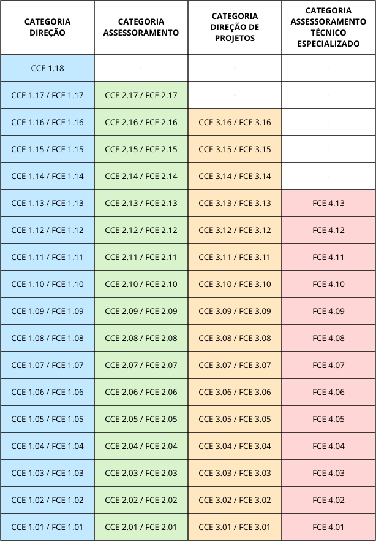
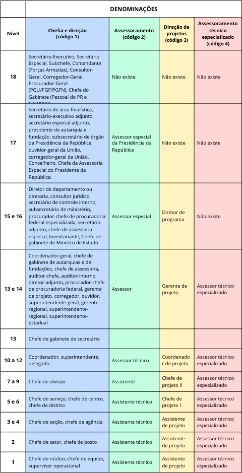

Cargos e funções
================

.. admonition:: Sobre este capítulo

   .. line-block::

      Neste capítulo você encontrará informações relacionadas aos cargos em comissão e às funções de confiança utilizados no âmbito do Poder Executivo Federal para estruturar as organizações da Administração Direta, autarquias e fundações de direito público.

A estrutura organizacional de uma entidade pública constitui-se de diferentes níveis hierárquicos, como secretarias, departamentos, coordenações etc. Essa hierarquia reflete a divisão de atribuições e responsabilidades dentro da entidade. Os cargos e funções representam posições formais dentro da estrutura organizacional associadas ao conjunto de atribuições e responsabilidades daquele nível da hierarquia.

Nesse sentido, as estruturas organizacionais são materializadas pelos cargos em comissão e pelas funções de confiança, já que os cargos e funções são atribuídos às autoridades a frente das unidades administrativas. Não existe estrutura organizacional sem cargos e funções. E, da mesma forma, não existe cargo ou função desvinculado de uma estrutura organizacional. Assim, de modo geral, *Estruturas Organizacionais* e *cargos e funções* são conceitos totalmente interdependentes.

De acordo com o inciso V do art. 37 da Constituição Federal, de 1988, as funções de confiança são exercidas exclusivamente por servidores ocupantes de cargo efetivo. Já os cargos em comissão são de livre provimento, observados os critérios de ocupação estabelecidos em lei. Atualmente, a lei nº 14.204, de 2021, em seu art. 12, estabelece casos, condições e percentual mínimo de cargos em comissão existentes na administração pública federal direta, autárquica e fundacional que deverão ser ocupados ocupados por servidores de carreira.

Tanto cargos em comissão como funções de confiança destinam-se às atribuições de direção, chefia e assessoramento. Porém, antes de entrar na definição de cargos em comissão e funções de confiança, é importante esclarecer o conceito de cargo público.

Cargo público
-------------

É o conjunto de atribuições e responsabilidades previstas na estrutura organizacional que devem ser cometidas a um servidor. Os cargos públicos, acessíveis a todos os brasileiros, são criados por lei, com denominação própria e vencimento pago pelos cofres públicos (art. 3º da Lei nº 8.112, de 1990).

Os detentores de cargos públicos têm vínculo estatutário com o Estado, regido, no plano federal, pela Lei nº 8.112, de 1990. A posse em cargo público dá-se pela assinatura do respectivo termo, no qual deverão constar as atribuições, os deveres, as responsabilidades e os direitos inerentes ao cargo ocupado, que não poderão ser alterados unilateralmente, por qualquer das partes, ressalvados os atos de ofício previstos em lei.

Os cargos públicos podem ser cargos efetivos ou cargos em comissão.

Cargos efetivos
---------------

Os cargos efetivos são criados por lei e podem ser de carreira ou cargos isolados. Seu provimento depende de prévia habilitação em concurso público de provas ou de provas e títulos, obedecidos a ordem de classificação e o prazo de sua validade (art. 10 da Lei nº 8.112, de 1990).

Os cargos efetivos na administração pública destinam-se a preencher funções permanentes dentro da estrutura do governo. Eles objetivam a continuidade dos serviços públicos, independentemente de mudanças políticas ou de gestão, uma vez que os servidores ocupam esses cargos independentemente do governo em exercício. É esperado que os servidores em cargos efetivos atuem de forma imparcial e neutra, independentemente de sua filiação política, já que sua permanência no cargo não está sujeita a mudanças de governo.

Cargos em comissão
------------------

Os cargos em comissão são criados por lei, geralmente, para o exercício das atribuições de direção, chefia e assessoramento. Seu provimento dispensa concurso público - são vocacionados à ocupação em caráter transitório, por pessoas de confiança da autoridade competente para preenchê-los, a qual também pode exonerá-los ad nutum, isto é, livremente, e a qualquer momento.

São exceções a essa regra os cargos em comissão destinados a autoridades com mandato, cuja exoneração só pode ocorrer ao fim do mandato ou nas hipóteses previstas em lei, como é caso dos diretores das agências reguladoras e do Banco Central.

.. attention::

       Embora os cargos em comissão sejam de livre provimento da autoridade competente para nomeá-los, seus ocupantes precisam atender a um conjunto de requisitos mínimos..

       São requisitos básicos para a investidura em cargo público (art. 5º da Lei nº 8.112, de 1990):

        I - a nacionalidade brasileira;

        II - o gozo dos direitos políticos;

        III - a quitação com as obrigações militares e eleitorais;

        IV - o nível de escolaridade exigido para o exercício do cargo;

        V - a idade mínima de dezoito anos; e

        VI - aptidão física e mental.

       São critérios gerais para a ocupação de cargos em comissão e de funções de confiança na administração pública federal direta, autárquica e fundacional (art. 9º da Lei nº 14.204, de 2021):

		    I – idoneidade moral e reputação ilibada;

		    II – perfil profissional ou formação acadêmica compatível com o cargo ou com a função para a qual tenha sido indicado; e

		    III – não enquadramento nas hipóteses de inelegibilidade previstas no inciso I do caput do art. 1º da Lei Complementar nº 64, de 18 de maio de 1990.

	   Além dos requisitos e critérios acima apresentados, os ocupantes de CCE e FCE deverão observar critérios específicos, de acordo com o nível, conforme estabelecido nos arts. 16 a 19 do Decreto nº 10.829, de 2021.

Dos cargos em comissão existentes na administração pública federal direta, autárquica e fundacional, no mínimo 60% do total deverão ser ocupados por servidores efetivos (inc. III do art. 13 da Lei nº 14.204, de 2021).

Funções de confiança
--------------------

As funções de confiança, assim como os cargos em comissão, são criadas por lei ou por transformação para o exercício das atribuições de direção, chefia e assessoramento. Seu provimento também dispensa concurso público - são vocacionadas à ocupação em caráter transitório, por pessoas de confiança da autoridade competente para preenchê-los, a qual também pode exonerar ad nutum, isto é, livremente, e a qualquer momento.

A diferença das funções de confiança para os cargos em comissão é que as funções são exclusivas de servidores públicos ocupantes de cargo efetivo. Para ocupar função de confiança no Poder Executivo Federal o servidor pode ter seu cargo efetivo vinculado a qualquer Poder e de qualquer ente da federação.

Considerando o disposto no inc. V do art. 37 da Constituição Federal, as funções de confiança não podem ser ocupadas por pessoas que não ocupam cargo efetivo, **nem por empregados públicos (pessoas empregadas em empresas estatais), nem por servidores aposentados e nem por militares, sejam da ativa ou da reserva**.

A tabela abaixo resume as características dos diferentes tipos de cargos públicos.

.. list-table::
   :header-rows: 1
   :widths: 20 25 25 30

   - * 
     * Cargo efetivo
     * Cargo em Comissão
     * Funções de Confiança

   - * A que se destina?
     * Funções permanentes dentro da estrutura do governo
     * Direção, chefia e assessoramento (estrutura organizacional)
     * Direção, chefia e assessoramento (estrutura organizacional)

   - * Nomeação/Designação
     * Após aprovação em concurso público, observados a ordem de classificação e o prazo de validade
     * A qualquer momento, a critério da autoridade superior
     * A qualquer momento, a critério da autoridade superior

   - * Demissão/Exoneração
     * Somente após processo administrativo
     * A qualquer momento, a pedido ou a critério da autoridade superior. Exceção: cargos com mandato
     * A qualquer momento, a pedido ou a critério da autoridade superior

   - * Quem pode ocupar?
     * Nomeados após aprovação em concurso público
     * Livre provimento, observadas as previsões normativas. (60% dos cargos em comissão existentes devem ser preenchidos por servidores efetivos)
     * Servidores públicos efetivos, de qualquer esfera e poder, observadas as previsões normativas. Obs.: não podem ser ocupadas por pessoas que não ocupam cargo efetivo, nem por servidores públicos de carreira aposentados, nem por militares (da ativa ou da reserva) e nem por empregados públicos. (Art. 37, inc. V da CF)

Quando uma lei cria cargos em comissão e/ou funções comissionados, estes são *armazenados* em uma **reserva técnica**, gerida pela Secretaria de Gestão e Inovação, do Ministério da Gestão e da Inovação em Serviços Públicos. Quando um órgão ou entidade precisa ser fortalecido (ou mesmo criado), cabe a esta Secretaria a análise inicial da demanda (link para o texto que traz os requisitos e documentações mínimos?) e o eventual encaminhamento, à Casa Civil, da minuta de decreto que realizará o remanejamento de cargos e funções.

Cargos Comissionados Executivos – CCE e Funções Comissionadas Executivas – FCE
------------------------------------------------------------------------------

O principal grupo de cargos em comissão e funções de confiança existentes no Poder Executivo federal, sem característica de exclusividade para determinados órgãos ou entidades, são os Cargos Comissionados Executivos (CCE) e Funções Comissionadas Executivas FCE) (Lei nº 14.204, de 16 de setembro de 2021).

Outras tipologias de cargos e funções podem ser consultadas aqui (incluir link para item específico - incluir os cargos NE nesse item).

Os cargos em comissão CCE (Cargos Comissionados Executivos) e funções de confiança FCE (Funções Comissionadas Executivas) foram instituídos pela Lei nº 14.204, de 2021, e substituíram  os cargos em comissão DAS (Direção e Assessoramento Superior) e as funções de confiança FCPE (Funções Comissionadas do Poder Executivo).  Em 2023, a mencionada Lei foi alterada, a fim de oferecer parâmetros para que as Agências Reguladoras também possam transformar  seus cargos exclusivos em CCE e FCE. Essa transformação é opcional, mas deve ser solicitada pelas agências até 31 de março de 2026.

Os CCE e as FCE são os tipos mais utilizados para constituir a estrutura organizacional na Administração Pública Federal, pois parte significativa deles está associada ao titular de unidades administrativas de órgãos e entidades. As principais exceções são as instituições federais de ensino, as agências reguladoras e o Banco Central do Brasil. Essas entidades têm tipos de cargos e funções próprios para estruturar-se.

Categorias dos CCE e das FCE
++++++++++++++++++++++++++++

Os CCE e as FCE são constituídos pelas seguintes categorias estabelecidas no art. 3º do Decreto nº 10.829, de 2021:

.. list-table::
   :header-rows: 1
   :widths: 15 10 15 10
   
   - * CCE
     * 
     * FCE
     * 

   - * Categoria
     * Código
     * Categoria
     * Código

   - * Direção
     * 1
     * Direção
     * 1

   - * Assessoramento
     * 2
     * Assessoramento
     * 2

   - * Direção de projetos
     * 3
     * Direção de projetos
     * 3

   - * 
     * 
     * Assessoramento técnico especializado
     * 4

**Chefia e direção** são duas das três atribuições que a Constituição de 1988, no inciso V do art. 37, determinou para os cargos em comissão e as funções de confiança. A outra atribuição é de **assessoramento**. A lei de criação do cargo ou da função deve prever, entre outras coisas, qual dessas três atribuições terá o cargo ou função.

As atribuições de chefia e direção estão associadas às categorias direção (código 1) e direção de projetos (código 3). As atribuições de assessoramento estão associadas às categorias assessoramento (código 2) e assessoramento técnico especializado (código 4).

Para CCE e FCE de nível 14 ou inferior é possível alterar a alocação, categoria e denominação do cargo ou função, por meio de portaria do dirigente máximo do órgão ou da entidade, ainda que tenha sido definido em decreto (inc. III do §2º do art. 13, Decreto nº 10.829, de 2021).

**Categoria Direção (código 1)**

	CCE e FCE da categoria Direção (código 1) destinam-se, sobretudo, aos titulares de unidades administrativas nas estruturas organizacionais de órgãos da administração direta e para parte das entidades de direito público da administração indireta.

	Em decorrência de sua atribuição de chefia e de direção, estes cargos e funções incorporam as responsabilidades correspondentes às competências da unidade, que advêm originariamente de leis ou decretos.

	Somente servidores titulares de cargo ou função da categoria direção (código 1) podem ser titulares de unidades administrativas. A recíproca não é sempre verdadeira. Há titulares de cargo ou função da categoria direção (código 1) que não são titulares de unidades administrativas e, consequentemente, não possuem competências específicas nem cargos ou funções a eles subordinados. Nas estruturas do Poder Executivo Federal são possíveis secretários adjuntos e diretores adjuntos.

	Os titulares de CCE/FCE de “Adjunto”, tais como Secretário-Adjunto, Diretor-Adjunto e Subsecretário-Adjunto, servem para reforçar o comando dos titulares de Secretarias, Subsecretarias e Diretorias de grande porte, unidades responsáveis por atribuições complexas, que gerenciam maior volume de recursos e/ou de atividades.

	Os servidores investidos em cargos em comissão ou em funções de confiança de chefia da categoria direção (código 1) podem ter substitutos, conforme prevê o art. 38 da Lei nº 8.112, de 1990, independentemente da existência de cargos em comissão ou de funções de confiança subordinadas a eles.

**Categoria Assessoramento (código 2)**

	A atribuição de assessoramento é uma das três atribuições que a Constituição de 1988, no inciso V do art. 37, dota aos cargos em comissão e às funções de confiança.

	A finalidade dos cargos ou funções da categoria assessoramento (código 2) é o assessoramento direto e imediato aos titulares dos cargos e das funções da categoria direção (código 1), aos cargos de natureza especial e aos cargos de Ministro de Estado.

	Como destinam-se à assistência ou assessoramento de quem chefia ou dirige, os cargos e funções de assessoramento não têm competências próprias. Por conseguinte, não são unidades administrativas no SIORG, não permitem a designação de substituto e não podem ter cargos em comissão ou funções de confiança a eles subordinados.

**Categoria Direção de Projetos (código 3)**

	Os CCE e FCE da categoria de direção de projetos (código 3) são destinados ao desenvolvimento de um ou mais projetos institucionais. Um projeto é um esforço temporário empreendido para criar um produto, serviço ou resultado específico. Os cargos e funções de direção de projetos são utilizados para o desenvolvimento de iniciativas importantes para a organização, especialmente nos casos em que essa atuação, para uma melhor efetividade, possa ser executada de forma matricial ou transversal à estrutura organizacional. Tais cargos também servem ao fortalecimento da capacidade de formulação estratégica, porque são um recurso adicional livre, que pode ser utilizado no desenvolvimento de iniciativas, atividades ou projetos especiais.

	Por óbvio, ter uma categoria específica para gestão de projetos não limita que as demais categorias gerenciem ou executem projetos na organização. A intenção é deixar as estruturas existentes mais flexíveis e preparadas para as constantes mudanças de um ambiente inovador.

	Embora cargos e funções de direção de projetos não correspondam a uma unidade organizacional administrativa, seus ocupantes podem:

		- liderar equipes compostas por servidores com ou sem cargos ou funções de qualquer categoria;
		- ter substitutos; e
		- ter subordinados. Caso os subordinados ocupem cargo ou função, estes deverão necessariamente ser da categoria de direção de projetos (código 3).

**Categoria Assessoramento Técnico Especializado (código 4)**

	A finalidade das funções da categoria assessoramento técnico especializado (código 4) é o assessoramento associado às competências da unidade que exijam conhecimentos técnicos específicos, caracterizados por especial nível de complexidade.

	Como destinam-se à assistência ou assessoramento de quem os chefia ou dirige, os cargos e funções de assessoramento não têm competências próprias. Por conseguinte, não são unidades administrativas no SIORG, não permitem a designação de substituto e não podem ter cargos em comissão ou funções de confiança a eles subordinados.

	Não há cargos em comissão nesta categoria, de forma que as funções de confiança desta categoria são privativas de servidores titulares de cargos efetivos.

A tabela abaixo resume as características das categorias dos CCE e das FCE.

.. list-table::
   :header-rows: 1
   :widths: 18 18 18 18 28
  
   - * Categoria
     * Direção (CCE ou FCE)
     * Assessoramento (CCE ou FCE)
     * Direção de projetos (CCE ou FCE)
     * Assessoramento técnico especializado (somente FCE)

   - * Código
     * 1
     * 2
     * 3
     * 4

   - * Finalidade
     * titulares de unidades administrativas nas estruturas organizacionais de órgãos da administração
     * assessoramento direto e imediato aos titulares dos cargos e das funções da categoria direção e aos cargos de Ministro de Estado
     * destinados ao desenvolvimento de um ou mais projetos institucionais, especialmente nos casos em que essa atuação, para uma melhor efetividade, possa ser executada de forma matricial ou transversal à estrutura organizacional.
     * assessoramento associado às competências da unidade prevista na estrutura organizacional do órgão ou da entidade que exigem conhecimentos técnicos específicos, caracterizados por especial nível de complexidade

   - * Pode ser titular de unidade administrativa?
     * Sim
     * Não
     * Não
     * Não

   - * Pode ter substituto?
     * Sim
     * Não
     * Sim
     * Não

   - * Pode ter subordinados?
     * Sim, se for titular de unidade administrativa
     * Não
     * Sim. Caso subordinados ocupem cargo ou função, este deverá ser de código 3
     * Não

Níveis dos CCE e das FCE
++++++++++++++++++++++++

Os CCE e as FCE são divididos em 18 níveis, numerados de 1 a 18, sendo 1 o menor nível e 18, o maior. Na designação de um CCE ou de uma FCE, utiliza-se o tipo do cargo ou função (CCE ou FCE) seguido do código da categoria (1 a 4), um ponto separador e o nível do cargo ou função (1 a 18).

A :numref:`Niveis-CCE-FCE-label` apresenta todas as configurações de níveis para CCE e FCE por categoria (Anexo I do Decreto 10.829, de 5 de outubro de 2021).

.. _Niveis-CCE-FCE-label:

   Níveis dos CCE e das FCE

CCE e FCE do mesmo nível e da mesma categoria são equiparáveis para todos os efeitos legais e regulamentares.

Regras básicas de ocupação de CCE e FCE:

  * Deve ser observado o disposto no art. 9º da Lei nº 14.204, de 2021, (critérios gerais para ocupação de CCE e FCE) e os arts. 15 a 19 do Decreto nº 10.829, de 2021, (critérios específicos para ocupação de CCE/FCE).

  * CCE de níveis 5 a 18: livre provimento;

  * CCE de níveis 1 a 4: somente poderão ser ocupados por servidor de carreira, empregado permanente da administração pública ou militar;

  * FCE de níveis 1 a 17:  somente poderá ser ocupada por servidor efetivo oriundo de órgão ou de entidade de quaisquer dos Poderes da União, dos Estados, do Distrito Federal e dos Municípios.

Denominações associadas aos níveis e categorias dos CCE e das FCE
+++++++++++++++++++++++++++++++++++++++++++++++++++++++++++++++++

A :numref:`Denominacoes-CCE-FCE-label` apresenta as denominações associadas a cada nível e categoria para as CCE e FCE.

.. attention::

   Em que pese haver casos em que a denominação se desvia daquelas listadas na figura, é importante que órgãos e entidade se atenham àquelas listadas na tabela, evitando a criação de outras denominações.

.. _Denominacoes-CCE-FCE-label:

   Denominações dos CCE e das FCE

O parâmetro de CCE-unitário
+++++++++++++++++++++++++++

De acordo com o art. 6º do Decreto nº 10.829, de 2021, na proposta de aprovação ou revisão de suas estruturas regimentais ou estatutos, os ministérios, órgãos e entidades deverão tomar como referência, para cálculo da despesa, o custo unitário efetivo expresso em CCE-Unitário.

O valor de um CCE-Unitário equivale ao valor da remuneração do cargo CCE de nível 5. O valor unitário dos demais cargos e funções é obtido dividindo-se o valor da remuneração do respectivo cargo ou função pelo valor da remuneração do CCE de nível 5. Os valores encontram-se fixados nas tabelas do sistema informatizado do SIORG, com duas casas decimais e podem ser consultados em https://siorg.gov.br/siorg-cidadao-webapp/resources/app/cargos-comissionados.html

O CCE-Unitário tem por objetivo facilitar o cálculo da despesa com cargos em comissão e funções de confiança quando da revisão ou aprovação das estruturas regimentais ou estatutos dos ministérios, órgãos e entidades. A finalidade do quadro resumo é demonstrar se houve ou não aumento de despesa na nova estrutura ou no novo estatuto aprovado, em comparação com os custos da estrutura até então vigente que será alterada.

.. seealso::
   
   **Saiba mais sobre a transformação de cargos e funções**
      A Lei nº 14.204, de 2021, autoriza o Poder Executivo federal a transformar cargos em comissão, funções de confiança e gratificações por meio de decreto.

      Na prática, isso significa que é possível *criar* novos cargos e funções por meio da transformação daqueles existentes na estrutura da instituição demandante ou na reserva técnica da Secretaria de Gestão e Inovação, sem a edição de nova lei.

      Essa transformação ocorre, necessariamente sem aumento de despesa. Assim a tabela que traz o demonstrativo dos cargos comissionados executivos – CCE e das funções comissionadas executivas – FCE transformados deve, obrigatoriamente, demonstrar o custo zero ou negativo, em CCE-unitários.

      É interessante notar que essa tabela não demonstra o impacto orçamentário da reestruturação organizacional em si, que pode ser positivo. Nesse caso, a nova estrutura terá um custo em CCE-unitários superior à estrutura atual, demonstrado no quadro resumo de custos dos cargos em comissão e das funções de confiança do órgão ou entidade.

      A tabela que demonstra as transformações necessárias à nova estrutura, nesse caso, incorporará cargos e funções vagos, disponíveis na chamada *reserva técnica*, de forma a demonstrar que não houve custo no ato da transformação. A consulta à reserva técnica é feita, atualmente, pela Secretaria de Gestão e Inovação, a quem cabe a construção da referida tabela.

Outros cargos em comissão e funções de confiança
++++++++++++++++++++++++++++++++++++++++++++++++
A maioria das estruturas dos ministérios, órgãos e entidades do Poder Executivo federal é composta Cargos Comissionados Executivos (CCE) e Funções Comissionadas Executivas (FCE). Porém, existem outras tipologias de cargos em comissão e de funções de confiança, em geral específicas para certos órgãos e entidades, que podem ser mencionadas como exceção a essa regra.

--------------------------------
Cargos de Natureza Especial - NE
--------------------------------
Os cargos de natureza especial (NE) são cargos de chefia ou direção que respondiam por uma unidade administrativa interna na estrutura da Presidência da República e dos ministérios, situada no nível mais alto de autoridade pública  na estrutura hierárquica dos órgãos, estando abaixo somente dos Ministros de Estado, em geral denominados Secretários-Executivos.

Após a edição da Lei nº XXX os cargos NE dos ministérios e dos órgãos da Presidência da República foram transformados em CCE 1.18.

Hoje existem cargos NE somente no Banco Central do Brasil e são ocupados pelo Presidente e pelos demais diretores.

Os servidores investidos em cargos de Natureza Especial podem ter substitutos, autorização prevista no art. 38 da Lei nº 8.112, de 1990, independentemente da existência de cargos em comissão ou de funções de confiança subordinadas a eles.

----------------------------------------------------------------------------
Cargos de Direção e Funções Gratificadas das instituições federais de ensino
----------------------------------------------------------------------------
As instituições federais de ensino (Instituições Federais de Ensino Superior, Institutos Federais de Educação, Ciência e Tecnologia, Centros Federais de Educação Tecnológica, Escolas Agrotécnicas Federais, Escolas Técnicas Federais e Instituições Federais de Ensino Militar) se estruturam a partir dos Cargos de Direção – CD, divididos em quatro níveis, das Funções Gratificadas, divididas em nove níveis, e das Funções Comissionadas de Coordenação de Curso – FCC.

De acordo com o § 3º do art. 1º da Lei nº 8.216, de 1991, podem ser nomeados para Cargo de Direção ou designados para Função Gratificada os servidores públicos federais da administração direta, autárquica ou fundacional não pertencentes ao quadro permanente da instituição de ensino, respeitado o limite de 10% (dez por cento) do total dos cargos e funções da instituição, admitindo-se, quanto aos Cargos de Direção, a nomeação de servidores já aposentados.

Por sua vez, a Função Comissionada de Curso - FCC foi instituída pelo art. 7º da Lei nº 12.677, de 25 de junho de 2012, para ser exercida, exclusivamente, por servidores que desempenhem atividade de coordenação acadêmica de cursos técnicos, tecnológicos, de graduação e de pós-graduação stricto sensu, regularmente instituídos no âmbito das instituições federais de ensino. De acordo com o § 1º do art. 7º, somente poderão ser designados para FCC os titulares de cargos da Carreira do Magistério Superior de que trata a Lei nº 7.596, de 10 de abril de 1987, e os Professores do Magistério do Ensino Básico, Técnico e Tecnológico, integrantes do Plano de Carreira e Cargos de Magistério do Ensino Básico, Técnico e Tecnológico, de que trata a Lei nº 11.784, de 22 de setembro de 2008. Por fim, conforme o § 2º do art. 7º, é vedada a percepção de FCC cumulativa com a retribuição de funções gratificadas, cargos de direção ou com qualquer outra forma de retribuição pelo exercício de cargo em comissão ou função de confiança.

---------------------------------------------
Cargos comissionados das agências reguladoras
---------------------------------------------
As agências reguladoras possuem Cargos em Comissão de Direção – CD, de Gerência Executiva – CGE, de Assessoria – CA e de Assistência – CAS, e os Cargos em Comissão Técnicos – CCT, conforme estabelecido na Lei nº 9.986, de 18 de julho de 2000, mas podem transformar seus cargos e funções em CCE e FCE, se assim optarem até 31 de março de 2026. Essas autarquias especiais possuem autonomia para alterar seus respectivos quantitativos de cargos e distribuí-los, no âmbito de cada grupo, sem aumento de despesa (art. 14 da Lei nº 9.986, 2000), independentemente da tipologia de cargos e funções adotada.

De acordo com as Leis nº 9.986, de 2000, e nº 14.204, de 2021:
  * os Cargos Comissionados de Gerência Executiva, de Assessoria e de Assistência são de livre nomeação e exoneração da instância de deliberação máxima da Agência;
  * o Presidente ou o Diretor-Geral ou o Diretor-Presidente (CD I ou CCE-18) e os demais membros do Conselho Diretor ou da Diretoria (CD II ou CCE-17) serão brasileiros, de reputação ilibada, formação universitária e elevado conceito no campo de especialidade dos cargos para os quais serão nomeados, devendo ser escolhidos pelo Presidente da República e por ele nomeados, após aprovação pelo Senado Federal, nos termos da alínea f do inciso III do art. 52 da Constituição Federal;
  * integrarão a estrutura organizacional de cada agência uma procuradoria, que a representará em juízo, uma ouvidoria e uma auditoria; e
  * em adotando o modelo de CCE e FCE, o titular da ouvidoria que esteja prevista em estrutura de agência reguladora ocupará CCE ou FCE de nível 15.

Também de acordo com o art. 33 da Lei nº 10.871, de 20 de maio de 2004, que dispõe sobre a criação de carreiras e organização de cargos efetivos das agências reguladoras:
  * os Cargos Comissionados Técnicos são de ocupação privativa de servidores ocupantes de cargos efetivos do Quadro de Pessoal Efetivo, de servidores do Quadro de Pessoal Específico, do Quadro de Pessoal em Extinção e dos membros da Carreira de Procurador Federal; e
  * poderão ser designados para Cargos Comissionados Técnicos níveis CCT-IV e V, além dos servidores referidos no caput deste artigo, servidores ocupantes de cargos efetivos ou de empregos permanentes da administração federal direta e indireta cedidos à Agência Reguladora, na forma do art. 93 da Lei nº 8.112, de 11 de dezembro de 1990.

Em adotando o modelo de CCE e FCE, os servidores cedidos às agências reguladoras para ocupação de Cargo Comissionado de Gerência Executiva (CGE) de nível IV e de Cargo Comissionado Técnico (CCT) de nível IV ou V poderão permanecer cedidos enquanto estiverem ocupando FCE de nível 8 ou superior.

Os limites do art. 14 da Lei nº 9.986, de 2000, já foram objeto dos Acórdãos TCU nº 569 e 1.600, de 2013, segundo os quais essa possibilidade de alteração de quantitativos deve ser interpretada em conjunto com o inciso V do art. 37 da Constituição Federal. Desse modo, atualmente é vedada a alteração de quantitativos de CCT em cargos de livre provimento (CGE, CA e CAS). Porém, desde que não haja aumento de despesa, é permitida:
  a)  a alteração dos quantitativos internamente a cada grupo – cargos de livre provimento (CGE, CA e CAS) e cargos privativos (CCT); e
  b)  a alteração de quantitativos de cargos de livre provimento em favor de cargos privativos, bem como a reversão da alteração realizada.

------------------------------------------------
Funções comissionadas do Banco Central do Brasil
------------------------------------------------
As Funções Comissionadas do Banco Central – FCBC foram criadas pela Lei nº 9.650, de 27 de maio de 1998, e são de exercício privativo por servidores do Banco Central do Brasil [#]_.

Seus quantitativos também poderão ser alterados por ato do Presidente do Banco Central do Brasil, desde que não impliquem aumento de despesa.

-----------------------------------------------------
Cargos em comissão e funções de confiança temporários
-----------------------------------------------------
É possível o remanejamento, por Decreto, de cargos em comissão e de funções de confiança da Secretaria de Gestão e Inovação, do Ministério da Gestão e da Inovação em Serviços Públicos, para órgãos e entidades em caráter temporário, até uma data máxima fixada no mesmo Decreto e com objetivo definido. Nesses casos, deverão estar explícitos no Decreto quais os cargos (ou funções) remanejados temporariamente, a data limite de permanência dos cargos e funções, a sua destinação e o seu caráter de transitoriedade.

.. epigraph:: Exemplo

   Art. 1º Ficam remanejados em caráter temporário, os seguintes Cargos Comissionados Executivos - CCE e Funções Comissionadas Executivas - FCE da Secretaria de Gestão e Inovação do Ministério da Gestão e da Inovação em Serviços Públicos para o (órgão ou entidade):
   
   - ..........
   
   - .........   
   
   § 1º Os cargos de que trata o caput:
   
   I - destinam-se a ...
   
   II - serão restituídos à Secretaria de Gestão e Inovação em (data completa de restituição, quando seus ocupantes ficarão automaticamente exonerados ou dispensados.
   
   § 2º Os cargos referidos no caput não integrarão a Estrutura Regimental (ou Estatuto) do (órgão ou entidade) e os atos de nomeação ou designação relacionados terão seu caráter de transitoriedade expressos, mediante remissão ao caput do art. 1º.

.. [#] Lei nº 9.650, de 1998, art. 12, § 6º.
