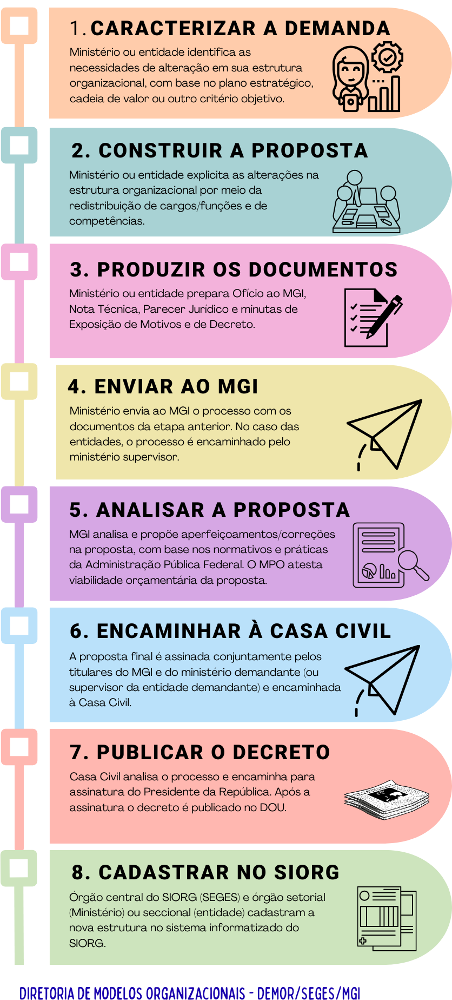
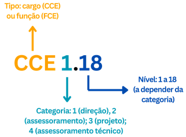
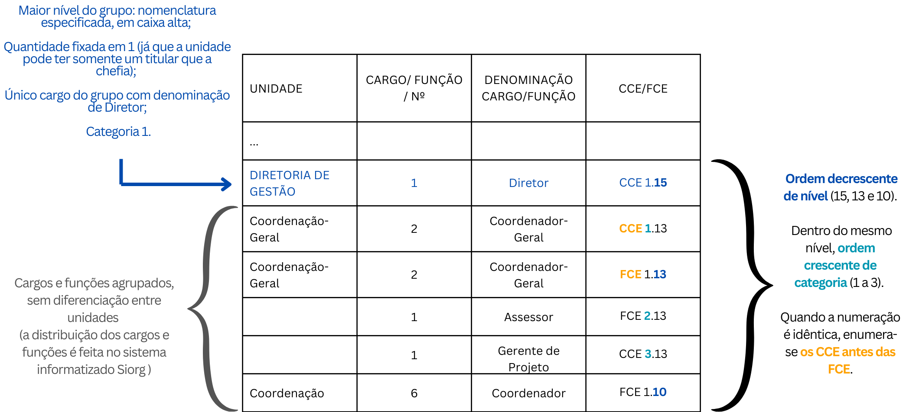

Como alterar uma estrutura regimental - passo a passo
=====================================================

.. admonition:: Sobre este capítulo

      O objetivo desse capítulo é fornecer um guia prático para a elaboração de todas as peças técnicas necessárias à instrução processual para uma alteração de estrutura regimental ou estatuto. 

      Se é sua primeira vez fazendo esse trabalho, recomendamos a leitura completa do capítulo.  

      Se você já tem experiência no assunto, mas tem dúvidas específicas, esses são os temas principais dessa parte do manual:
            - Qual é o fluxo ordinário de um processo de reestruturação;
            - Como definir o tipo de decreto adequado ao meu caso;
            - Como alterar uma estrutura regimental para um órgão da administração direta;
            - Como alterar uma estrutura regimental ou estatuto para uma autarquia ou fundação pública;
            - Como elaborar uma nota técnica ou parecer de mérito;
            - Como elaborar uma minuta de exposição de motivos interministerial.

Fluxo de uma reestruturação organizacional
-------------------------------------------

Na :numref:`fluxo-reestruturacao-label` você encontra o fluxo normal de uma reestruturação organizacional de ministério ou entidade.

.. _fluxo-reestruturacao-label:

   Fluxo de uma reestruturação organizacional

Peças que compõem um processo de reestruturação organizacional
---------------------------------------------------------------

Como falamos aqui, órgãos e entidades do Poder executivo federal são criados por lei e têm suas estruturas regimentais e estatutos aprovados por decreto presidencial. Alterações desses instrumentos exigem, portanto, a edição de um novo decreto presidencial e devem seguir um rito específico, iniciado a partir da elaboração e submissão da proposta ao órgão central do Siorg.

As peças que instruem essa proposta são elaboradas pelo órgão ou entidade interessada, estabelecidas pelo art. 5º do Decreto nº 9.739, de 28 de março de 2019 (link): 

    a) minuta de exposição de motivos interministerial; 

    b) minuta de decreto e seus anexos; 

    c) nota técnica da área competente; e 

    d) parecer jurídico. 

Se a proposta visar a reestruturação de um órgão da Presidência da República ou Ministério, a autoridade máxima encaminhará esses documentos, via Ofício, ao Ministério da Gestão e da Inovação em Serviços Públicos (MGI).  

Se a proposta visar a reestruturação de uma autarquia ou fundação pública, a autoridade máxima da entidade encaminhará o ofício ao Ministério supervisor e este complementará a proposta com um parecer jurídico e uma nota técnica próprios. A documentação completa será submetida ao MGI, via ofício assinado pelo Ministro. 

Tipos de decreto para reestruturação organizacional de órgãos ou entidades 
--------------------------------------------------------------------------
 
Independentemente se órgão, autarquia ou fundação pública, a peça que materializará as alterações necessárias à estrutura organizacional é a minuta de decreto.  

A forma de organização dessa peça deve ser definida após um estudo interno sobre as alterações que serão necessárias na estrutura organizacional vigente (link para o site com as estruturas vigentes?), sempre considerando o alcance dos objetivos institucionais e a entrega de serviços públicos. Feita essa reflexão e o mapeamento das alterações que serão necessárias, a definição do tipo de decreto mais adequado dependerá do tipo de alteração almejada: 

1) **Alterações numerosas e significativas**, que demandam reestruturação completa da estrutura regimental ou estatuto.
      **Indicação**: edição de decreto que aprova uma nova estrutura regimental ou estatuto. Falamos, aqui, numa substituição da norma existente, que será revogada. Assim, segue-se, de forma geral, a mesma organização do decreto vigente.
    
      **Organização sequencial padrão**: Epígrafe, ementa, preâmbulo (link para o Decreto n. 12.002, de 22 de abril de 2024) e texto principal contendo, resumidamente, os remanejamentos necessários à nova estrutura, regramentos específicos, revogação do decreto que trata da estrutura atual e, se for o caso, de outros que a alteraram, e data de vigência da nova estrutura (download de modelo);
       **Anexo I**: traz a descrição de toda estrutura regimental ou estatuto, com as competências e atribuições de suas unidades (link);

       **Anexo II**: contendo:

            a) o quadro demonstrativo dos cargos em comissão e das funções de confiança (link); e

            b) o quadro resumo de custos (link) dos cargos em comissão e das funções de confiança (link).
       **Anexo III**: contendo quadros com os remanejamentos já descritos no texto principal, com custo unitário e total (link); e

       **Anexo IV**: com quadro demonstrativo dos cargos comissionados executivos – CCE e das funções comissionadas executivas - FCE, contendo as transformações de cargos e funções que serão necessárias à estrutura proposta. Esse anexo nem sempre é necessário e depende de alguns fatores, que você pode ler aqui (link).

            .. warning::

                  A Diretoria de Modelos Organizacionais, da Seges, desenvolveu uma planilha que constrói automaticamente os anexos II e III, a partir do quadro demonstrativo dos cargos e funções. Essa mesma planilha informa também se a alteração implicará ou não impacto orçamentário.

                  (Download, com passo a passo sobre a planilha?)

2) **Alterações pontuais e simples**
      **Indicação**: decreto que altera a atual estrutura regimental ou estatuto. 

      **Organização sequencial padrão**: epígrafe, ementa, preâmbulo, com texto principal e anexos dependentes das alterações propostas. 

      a) **Se relacionadas somente à alteração de quantidade, categoria ou nível de cargos e funções, sem a criação ou extinção de unidades de diretoria ou secretaria, ou revisão de suas competências.**
            O texto principal trará os remanejamentos necessários, a referência ao anexo de transformação de cargos e funções (se houver), a revogação de algum ato ou dispositivo normativo (se houver) e a data de vigência da nova estrutura (download de modelo); 

            Anexo I: contendo quadros com os remanejamentos já descritos no texto principal, com custo unitário e total (link); e 

            Anexo II: com quadro demonstrativo dos cargos comissionados executivos – CCE e das funções comissionadas executivas - FCE, contendo as transformações de cargos e funções que serão necessárias à estrutura proposta. Esse anexo nem sempre é necessário e depende de alguns fatores, que você pode ler aqui. Em não sendo necessário, o Anexo III (abaixo) denomina-se Anexo II. 

            Anexo III: se houver necessidade de substituição dos quadros em vigor, contendo o quadro demonstrativo dos cargos em comissão e das funções de confiança (link) e o quadro resumo de custos dos cargos em comissão e das funções de confiança (link). 

            .. warning::

                  Algumas alterações na estrutura de cargos e funções podem ser realizadas por meio de Portaria Ministerial. Esse é o caso das permutas entre cargos e funções de mesmo nível e categoria, e das realocações de cargos e funções de nível 14 ou inferior. (complementar)

                  Essas alterações dispensam a edição de um decreto presidencial e seguem as regras estabelecidas nos art. 12 e 13 do Decreto n. 10.829/21 (link).

      b) **Se relacionadas somente à revisão das competências criação de unidades de diretoria ou secretaria, sem alteração de quantidade, categoria ou nível de cargos e funções.**
            O texto principal trará, resumidamente, as alterações propostas nas competências das unidades específicas, a revogação de algum ato ou dispositivo normativo (se houver) e a data de vigência da nova estrutura. Não há Anexos. (download de modelo);

      c) **Se relacionadas à alteração de quantidade, categoria ou nível de cargos e funções, com a criação de unidades de diretoria ou secretaria, ou revisão de suas competências.**
            O texto principal trará os remanejamentos necessários, a referência ao anexo e transformação de cargos e funções (se houver), as alterações propostas na estrutura básica e nas competências das unidades específicas, regramentos específicos (se houver), a revogação de algum ato ou dispositivo normativo (se houver) e a data de vigência da nova estrutura (download de modelo);

            Anexo I: contendo quadros com os remanejamentos já descritos no texto principal, com custo unitário e total (link); e

            Anexo II: com quadro demonstrativo dos cargos comissionados executivos – CCE e das funções comissionadas executivas - FCE, contendo as transformações de cargos e funções que serão necessárias à estrutura proposta. Esse anexo nem sempre é necessário e depende de alguns fatores, que você pode ler aqui. Em não sendo necessário, o Anexo III (abaixo) denomina-se Anexo II.

            Anexo III: se houver necessidade de substituição dos quadros em vigor, contendo o quadro demonstrativo dos cargos em comissão e das funções de confiança (link) e o quadro resumo de custos dos cargos em comissão e das funções de confiança (link).

            .. note::

               A divisão da norma em anexos é exclusivamente didática, sendo impossível dissociar as competências de uma unidade de sua estrutura de cargos e funções. Afinal, são a complexidade, a finalidade e a natureza da atuação de uma unidade que determinarão o desenho organizacional mais adequado para ela.

3) **Necessidades temporárias de cargos ou funções, para atendimento a necessidades emergenciais, transitórias ou estratégicas, por período certo e finalidade determinada.**
       **Indicação**: decreto que remaneja, em caráter temporário, cargo em comissão ou função de confiança do Órgão Central de Administração, responsável pela reserva técnica de cargos em comissão e funções de confiança, para órgão e entidades.

       **Organização sequencial padrão**: Epígrafe, ementa, preâmbulo. O texto principal deve incluir, necessariamente:
          - Os remanejamentos propostos;

          - A finalidade dos cargos e funções;

          - A data de restituição dos cargos e funções; e

          - Dispositivo que informa que os cargos as funções não integrarão a estrutura regimental do órgão ou entidade, e que os atos de nomeação ou designação relacionados terão seu caráter de transitoriedade expressos, mediante remissão ao caput do art. 1º.

      O texto principal abrange ainda: referência à transformação de cargos e funções (se houver), regramentos específicos (se houver), revogação de algum ato ou dispositivo normativo (se houver) e data de vigência (inserir modelo como exemplo).

      **Anexo**: se houver transformações, deverá refletir o quadro demonstrativo dos cargos comissionados executivos - CCE e das funções comissionadas executivas - FCE, transformados. Esse anexo nem sempre é necessário e depende de alguns fatores, que você pode ler aqui.

.. Tipodecreto-label:
.. figure:: ../_static/images/Fig1_tipos_de_decreto.png
   :alt: Tipos de decreto
   :align: center
   :name: Tipodecreto

Alteração de estruturas regimentais de órgãos da Presidência da República e dos Ministérios (Anexo I) 
-----------------------------------------------------------------------------------------------------

Conhecimentos básicos: unidades e competências obrigatórias
+++++++++++++++++++++++++++++++++++++++++++++++++++++++++++
As competências (link glossário) de cada órgão são dadas pela lei que organiza a Administração Pública federal, usualmente publicada no início do governo em exercício, na forma de medida provisória (vide Lei n. 14.600, de 19 de junho de 2023).

Propostas de alteração de estrutura devem, inicialmente, observar essa lei quanto:

      a. competências do órgão, que devem ser replicadas no art. 1º do anexo I do decreto que aprova sua estrutura regimental, e que devem nortear as competências de todas outras unidades subordinadas. Esse é o único artigo que compõe o Capítulo I: Da natureza e da competência.

      b. unidades obrigatórias e regramentos específicos a serem observados no desenho da estrutura organizacional, inclusive quanto ao limite de Secretarias em cada Ministério.

Atualmente, a Lei n. 14.600/23 (link para art. 50 da lei) determina que são obrigatórias as seguintes unidades (link em cada unidade?):
-     Gabinete do Ministro;
-     Secretaria-Executiva, exceto no Ministério da Defesa e no Ministério das Relações Exteriores;
-     Consultoria Jurídica;
-     Ouvidoria; 
-     Secretarias; e
-     "Órgão responsável pelas atividades de administração patrimonial, de material, de gestão de pessoas, de serviços gerais, de orçamento e finanças, de contabilidade e de tecnologia da informação, vinculado à Secretaria-Executiva".

Para essas e todas as demais unidades que compõem o órgão, deve-se observar a necessidade de definição das competências no decreto que trata da estrutura, determinada pelo Decreto n 10.829, de 2021: 
“Art. 5º  O decreto que aprovar a estrutura regimental ou o estatuto do órgão ou da entidade deverá discriminar, em anexo específico:
      I - as competências do órgão e de suas secretarias, ou equivalentes, quando se tratar da administração pública direta; e
      (...)
      § 1º  A discriminação de que trata o caput poderá ser estendida às demais unidades administrativas, até o limite de CCE ou FCE de nível 15, observadas as competências e as especificidades do órgão ou da entidade.”

Atualmente, convencionou-se descrever as competências de todas as unidades de nível 15 ou superior (nível de diretoria ou departamento).

Ainda, quando as unidades estiverem subordinadas diretamente ao Ministro, entende-se que são equivalentes às Secretarias, independentemente de seu nível, cabendo também a discriminação de suas competências. São exemplos de unidades dessa natureza a Ouvidoria, a Corregedoria e as Assessorias que não compõem o Gabinete do Ministro. Aqui, é possível consultar os níveis a serem associados a cada unidade.

Assim, se sua proposta cria ou extingue alguma unidade com essas características, será necessário inserir ou excluir suas competências. 

.. warning::

                  A não ser que haja previsão legal, fique atento para que sua proposta não traga alterações que gerem sombreamento de competências com outros órgãos.

Organização básica e elementos da estrutura regimental
++++++++++++++++++++++++++++++++++++++++++++++++++++++
A organização do Anexo I segue os princípios definidos pelo Decreto n. 12.002, de 22 de abril de 2024, onde constam as normas gerais para elaboração, redação, alteração e consolidação de atos normativos. Todos esses princípios devem ser observados também em propostas de alteração de estruturas regimentais.

.. note::

   O Decreto n. 12.002, de 22 de abril de 2024 permite compreender como estruturar um ato normativo, o que deve ser observado em sua redação para manter a clareza, precisão e ordem lógica, formatação (como espaçamentos, uso de negritos e itálicos), regras para alterações e para as revogações. (inserir links para as partes específicas da norma).

No caso das estruturas, a divisão do texto que trata da estrutura regimental segue a seguinte lógica:

.. admonition:: Capítulo I: DA NATUREZA E DA COMPETÊNCIA

      Por padrão, abrange somente o art. 1º, que traz as competências do órgão:
      
      “Art. 1º  O [nome do órgão], órgão da administração pública federal direta, tem como área de competência os seguintes assuntos: 
      
      [competências idênticas às constantes na lei que estabelece a organização básica dos órgãos da Presidência da República e dos Ministérios]“

.. admonition:: Capítulo II: DA ESTRUTURA ORGANIZACIONAL

      Por padrão, abrange somente o art. 2º, que traz a organização interna do órgão (uma descrição do organograma básico do órgão), dividida da seguinte forma:

      I - órgãos de assistência direta e imediata ao Ministro de Estado (link): engloba todas as unidades de assessoria direta (começando pelo Gabinete do Ministro e seguindo com suas Assessorias Especiais), unidades setoriais (Ouvidoria, Corregedoria, Consultoria Jurídica) e a Secretaria-Executiva, com suas Subsecretarias.
      
      II - órgãos específicos singulares: engloba as unidades finalísticas do órgão, ou seja, as Secretarias e suas Diretorias ou Departamentos.
      
      III – unidades descentralizadas (se houver): engloba todas as unidades situadas em município distinto ao da sede do órgão.
      
      IV – órgãos colegiados (se houver): engloba colegiados criados por lei, sob responsabilidade do órgão.
      
      V – entidades vinculadas (se houver): engloba autarquias, fundações públicas e empresas públicas vinculadas ao órgão.

Exemplo simplificado

.. Organograma-label:
.. figure:: ../_static/images/Fig2_Organograma_Ministerio.png
   :alt: Organograma
   :align: center
   :name: Organograma

.. admonition:: Capítulo III: DAS COMPETÊNCIAS DOS ÓRGÃOS

      Esse capítulo descreve as competências de todas as unidades organizacionais elencadas no art. 2º, na exata ordem que lá aparecem. Para cada grupo de unidades, haverá uma Seção específica. E para cada unidade organizacional, haverá um artigo.

.. note::

   A redação de competências segue regras e boas práticas gerais, definidas a partir no Decreto n. 12.002, de 22 de abril de 2024.

   Todas as unidades setoriais têm suas atribuições gerais estabelecidas por normas específicas e, em alguns casos, a redação de suas competências foi padronizada pelo órgão central do sistema.

Como o Gabinete do Ministro é uma unidade obrigatória em todos os órgãos com status ministerial, conforme lei que estabelece a organização básica dos órgãos da Presidência da República e dos Ministérios, começaremos o Capítulo III por ele.

Assim:

“**Seção I**

**Dos órgãos de assistência direta e imediata ao Ministro de Estado X**

Art. 3º  Ao Gabinete compete:

I - xxx”

.. hint::
   
      Alterações pontuais de competências de unidades existentes serão feitas na forma de substituição do texto vigente. Por exemplo:

            "Art. 3º  O Anexo I ao Decreto nº [número do decreto com a estrutura vigente, com data], passa a vigorar com as seguintes alterações:

            “Art. 12.  .....................................................................................
            
            II - supervisionar, no âmbito do Ministério, as atividades de modernização administrativa;
            ..........................................................................................................” (NR)

      Alterações pontuais que visem a criação de nova unidade serão feitas na forma de inserção de artigo, na ordem definida pela nova organização prevista no art. 2º.

      No exemplo de criação de nova unidade denominada Subsecretaria de Gestão Administrativa, subordinada à já existente Secretaria-Executiva, altera-se o art. 2º e inclui-se suas competências logo após as atualmente descritas para a Secretaria-Executiva (art. 12):

            "Art. 3º  O Anexo I ao Decreto nº [número do decreto com a estrutura vigente, com data], passa a vigorar com as seguintes alterações:

            “Art. 2º  .......................................

            I - ..............................................................

            j) Secretaria-Executiva: Subsecretaria de Gestão Administrativa;
            ...................................................................................” (NR)

            “Art. 12-A  À Subsecretaria de Gestão Administrativa compete:

            I - assistir o Ministro de Estado na definição de diretrizes, na supervisão e na coordenação das atividades das Secretarias integrantes da estrutura do Ministério; e

            II - supervisionar, no âmbito do Ministério, as atividades de modernização administrativa."

      Nesse segundo exemplo, o quadro demonstrativo de cargos e funções (Anexo II) também é substituído, com inclusão de novo bloco de cargos e funções (link).

.. admonition:: Capítulo IV: DAS ATRIBUIÇÕES DOS DIRIGENTES

      Esse capítulo define XXXX.

Alteração do quadro demonstrativo dos cargos em comissão e das funções comissionadas (Anexo II a)
-------------------------------------------------------------------------------------------------

O quadro demonstrativo de cargos é um resumo do organograma do órgão que foi descrito no art. 2º do Anexo I, representado por uma tabela. A fim de facilitar as consultas aos decretos vigentes, convencionou-se substituir esse quadro por inteiro sempre que sofre alterações.

Essa tabela é formada por quatro colunas e traz todos os cargos em comissão e as funções comissionadas de que o órgão dispõe, representados por códigos.

.. AnexoIIA-label:
.. figure:: ../_static/images/Fig3a_anexoiia.png
   :alt: AnexoIIA
   :align: center
   :name: Anexo II a

Cada cargo ou função tem um código que identifica o tipo, a categoria e o nível:

.. codigoccefce-label:

E cada código possui uma ou mais denominações específicas, conforme a tabela XXX.

.. seealso::
   
   Para saber mais sobre os diferentes tipos, categorias e níveis, consulte o capítulo x.

Os cargos e funções existentes no órgão são agrupados conforme regras dispostas no Decreto nº 10.829, de 2021, que já orientou o desenho do Anexo I: se a unidade consta no art. 2º, há competência descrita e a unidade precisa ser nomeada no quadro demonstrativo. Essa unidade e os cargos e funções a ela subordinados compõem um grupo, no qual as unidades subordinadas recebem nomenclatura genérica e são apresentadas de forma agrupada.

.. QuadroCargos-label:

Como se observa do exemplo acima, a organização do quadro demonstrativo respeita a seguinte ordem para cada grupo:

Primeira linha do grupo:

      Coluna 1: Nome da unidade específica em caixa alta (conforme art. 2º do Anexo I);

      Coluna 2: 1, uma vez que só é possível haver um chefe para a unidade;

      Coluna 3: Nome do cargo ou função da chefia da unidade (que não pode se repetir no mesmo grupo); e

      Coluna 4: código do cargo ou função do chefe da unidade, necessariamente de categoria 1 (direção), no maior nível do grupo

Segunda linha:

Cargo ou função da chefia adjunta, se o grupo for chefiado por um cargo ou função de nível 17 ou 18:

      Coluna 1: Vazio (já que um adjunto não chefia unidade);

      Coluna 2: quantidade de chefias adjuntas (usualmente limitada a 1);

      Coluna 3: Nome do cargo ou função da chefia da unidade seguido do termo “Adjunto”; e

      Coluna 4: Código do cargo ou função com o segundo maior nível do grupo, necessariamente de categoria 1 (direção).

.. note::

   O Adjunto é o único cargo ou função de categoria 1 que não chefia unidade. A todos os demais deve ser associada uma unidade sem nomenclatura específica.

Linhas seguintes:

Observam a ordem decrescente de nível. Dentro do mesmo nível, observa-se a ordem crescente da categoria. Se existe um cargo e uma função com a mesma categoria e o mesmo nível, o cargo (CCE) é posicionado antes da função (FCE).

Finalizada a descrição do grupo, pula-se uma linha da tabela e inicia-se o grupo com a próxima unidade descrita no art. art. 2º do Anexo I.

O que mais levar em consideração:

      1) O cargo do Ministro não consta no quadro;

      2) Os primeiros cargos e funções constantes na tabela serão os que assessoram diretamente o Ministro (categorias 2 ou 3);

      3) Os CCE ou as FCE de mesma denominação não podem ter relação de subordinação entre si;

      4) Todas as alterações realizadas por portaria ministerial devem ser consideradas no novo quadro demonstrativo (e no quadro resumo de custos), já que esse será o retrato mais recente da estrutura do órgão. Alterações não incorporadas – ainda que acidentalmente - exigirão, portanto, nova portaria ministerial de realocação ou permuta e, provavelmente, novos atos de nomeação ou designação;

      5) O custo da estrutura proposta deve sempre ser considerado no ato de sua construção. Propostas com impacto orçamentário dependem da disponibilidade de cargos e funções na reserva técnica e exigem articulação junto à Seges, podendo não ser acatadas em sua integralidade, ainda que cumpram requisitos legais e de boas práticas.

As demais tabelas que compõem o decreto que aprova a estrutura regimental seguem essas regras.

Conhecendo as unidades administrativas da administração direta e suas regras específicas
----------------------------------------------------------------------------------------
As regras a seguir focam na estruturação hierárquica das unidades, que são chefiadas por ocupantes de cargos e funções da categoria 1. No entanto, outros tipos de cargos e funções (categorias 2, 3 e 4), que não são visíveis no organograma do órgão, podem compor a estrutura de cada unidade. 

A regra básica para definir se um cargo ou função pode ser inserido em dada unidade é: se o nível for menor do que o atribuído ao titular, é possível alocá-lo na unidade. Aqui é possível saber mais sobre as nomenclaturas e atuação associadas a cada categoria.

Órgãos de assistência direta e imediata ao Ministro de Estado
+++++++++++++++++++++++++++++++++++++++++++++++++++++++++++++

**a) Gabinete do Ministro**

Unidade obrigatória: sim

Nomenclatura permite complemento: não

Sobre o titular: Chefe de Gabinete, ocupante de cargo ou função, necessariamente de código 1.15 ou 1.16 em Ministérios. Em órgãos da Presidência da República, foi convencionado o código 1.17.

Sobre as competências: necessariamente descritas em Decreto. 

Sugere-se, no mínimo:
Não há um padrão 

Ainda, dependem de sua estruturação (por exemplo: se exerce atividades de cerimonial). 
Devem contemplar, no mínimo...

**b) Assessoria Especial de Controle Interno**

Unidade obrigatória: não, mas é necessário que o órgão conte ao menos com um Assessor Especial responsável pela temática.

Nomenclatura permite complemento: não

Sobre o titular: Chefe de Assessoria Especial, necessariamente FCE 1.15.

Sobre as competências: necessariamente descritas em Decreto, definidas pelo art. 13 do Decreto nº 3.591, de 2000.

.. admonition:: Outras informações

   Apesar de apoiar o Sistema de Controle Interno do Poder Executivo Federal, instituído pelo Decreto nº 3.591, de 6 de setembro 2000, as Assessorias Especiais de Controle Interno não são órgãos setoriais desse Sistema, papel esse reservado às Secretarias de Controle Interno da Casa Civil, da Advocacia-Geral da União, do Ministério das Relações Exteriores e do Ministério da Defesa.

**c) Outras Assessorias e Assessorias Especiais**

Unidades obrigatórias: não

Nomenclatura permite complemento: sim, necessariamente.

Sobre o titular: Chefe de Assessoria, de código 1.13 ou 1.14, no caso da Assessoria; Chefe de Assessoria Especial, de código 1.15 ou 1.16, no caso da Assessoria Especial, independente da denominação complementar da unidade.

A escolha do nível da Assessoria depende da complexidade dos processos analisados e do número de servidores atuantes na unidade.

Sobre as competências: descritas em decreto se nível 15 ou 16 (Assessoria Especial), ou se não estiver subordinada a outra unidade (Assessoria).

Serão definidas a partir da temática específica, devendo sempre estar associadas à assistência direta ao Ministro, em assuntos de interesse do Ministério, que envolvam conhecimentos e articulações que ultrapassam aqueles das unidades finalísticas.

São Assessorias típicas:

      Assessoria de Participação Social e Diversidade

      Assessoria de Relações Internacionais

      Assessoria de Comunicação Social

      Assessoria Parlamentar

.. warning::

   O uso da denominação “Assessoria” para designar uma unidade é restrita àquela de assistência direta e imediata Ministro de Estado – a existência de assessores não implica a constituição de unidade administrativa desse tipo.

**d) Órgãos setoriais**

São aquelas unidades que executam atividades comuns a todos os órgãos, sob coordenação de um órgão central, formando um sistema estruturador. 

      *Ouvidoria*

            Unidade obrigatória: sim

            Nomenclatura permite complemento: sim, em casos excepcionais, quando se tratar de Ouvidoria que contemple atividades que extrapolam a atuação do órgão (a exemplo da Ouvidoria-Geral do Sistema Único de Saúde e Ouvidoria Nacional dos Direitos Humanos).

            Sobre o titular: Ouvidor, CCE ou FCE, usualmente de código 1.13 ou 1.14, exceto quando responsável por atividades de alta complexidade e capilaridade.

            Sistema estruturador associado: Sistema de Ouvidoria do Poder Executivo federal, instituído pelo Decreto nº 9.492, de 5 de setembro de 2018.

            Órgão central do sistema: Controladoria-Geral da União, por meio da Ouvidoria-Geral da União.

            Sobre as competências: necessariamente descritas em Decreto, definidas pelo art. 10 do Decreto nº 9.492, de 2018.

.. admonition:: Outras informações

   A nomeação, a designação, a exoneração ou a dispensa dos titulares das unidades setoriais do Sistema de Ouvidoria do Poder Executivo federal será submetida, pelo dirigente máximo do órgão ou da entidade, à aprovação da Controladoria-Geral da União.

      *Corregedoria*

            Unidade obrigatória: não

            Nomenclatura permite complemento: não

            Sobre o titular: Corregedor, CCE ou FCE, usualmente de código 1.13 ou 1.14.

            Sistema estruturador associado: Sistema de Correição do Poder Executivo Federal, instituído pelo Decreto nº 5.480, de 30 de junho de 2005.

            Órgão central do sistema: Controladoria-Geral da União, por meio da Corregedoria-Geral da União.

            Sobre as competências: necessariamente descritas em Decreto, definidas pelo art. 5º do Decreto nº 5.480, de 2005.

.. admonition:: Outras informações

   A indicação dos titulares das unidades setoriais de correição será submetida previamente à apreciação do Órgão Central do Sistema de Correição.  Os critérios para nomeação ou designação são definidos pelo art. 8º do Decreto nº 5.480, de 2005.

**e) Consultoria Jurídica**

      Unidade obrigatória: sim

      Nomenclatura permite complemento: não

      Sobre o titular: Consultor Jurídico, necessariamente FCE, usualmente de código 1.15. 

      Sobre as competências: necessariamente descritas em Decreto, definidas pelo art. 11 da Lei Complementar nº 73, de 10 de fevereiro de 1993.

As Consultorias Jurídicas junto aos Ministérios são órgãos de execução da Consultoria-Geral da União (da Advocacia-Geral da União). Integram a estrutura organizacional dos respectivos Ministérios, sendo subordinadas administrativamente ao Ministro, mas nos aspectos técnico e jurídico, subordinam-se ao Consultor-Geral da União e ao Advogado-Geral da União.

**f) Secretaria-Executiva**

      Unidade obrigatória: sim

      Nomenclatura permite complemento: não

      Sobre o titular: Secretário-Executivo, necessariamente de código CCE 1.18.

      Sistemas estruturadores usualmente associados:

            Sistema de Planejamento e de Orçamento Federal,

            Sistema de Administração Financeira Federal,

            Sistema de Organização e Inovação Institucional - SIORG,

            Sistema de Gestão de Documentos de Arquivo - SIGA,

            Sistemas de Pessoal Civil da Administração Federal - SIPEC,

            Sistema de Serviços Gerais - SISG

            Sistema de Contabilidade Federal 

Sobre as competências: necessariamente descritas em Decreto.

Sugere-se:

      "*Compete à Secretaria-Executiva*:

      *I - assistir o Ministro de Estado na definição de diretrizes e na supervisão e coordenação das atividades das Secretarias integrantes da estrutura do Ministério [e de suas entidades vinculadas (quando houver)]; e*

      *II - orientar, no âmbito do Ministério, a execução das atividades de administração patrimonial e das atividades relacionadas aos sistemas federais de planejamento e de orçamento, de contabilidade, de administração financeira, de administração dos recursos de informação e informática, de recursos humanos, de organização e inovação institucional e de serviços gerais*.

      *Parágrafo único.  A Secretaria-Executiva exerce a função de órgão setorial dos Sistemas de Planejamento e de Orçamento Federal, de Administração Financeira Federal, de Organização e Inovação Institucional - SIORG, de Gestão de Documentos de Arquivo - SIGA, de Pessoal Civil da Administração Federal - SIPEC, de Serviços Gerais - SISG, de Contabilidade Federal e de Administração dos Recursos de Tecnologia da Informação - SISP*”.

Caso o órgão integre o Centro de Serviços Compartilhados Colaboragov, a Secretaria de Serviços Compartilhados, do Ministério da Gestão e da Inovação em Serviços Públicos, atua como órgão setorial desses sistemas, nos termos do Decreto nº 11.837, de 21 de dezembro de 2023. 

Regras específicas sobre a estrutura de cargos e funções que compõem a Secretaria-Executiva:

      1.Foi convencionado que todos os Secretários-Executivos contarão com um Secretário-Executivo Adjunto, CCE ou FCE, de código 1.17.

      2. A Secretaria-Executiva é usualmente estruturada em Subsecretarias (chefiadas por um Subsecretário, ocupante de CCE ou FCE, de código 1.15 ou 1.16), com competências e estrutura delimitadas em decreto. Aqueles órgãos que aderiram ao Centro de Serviços Compartilhados Colaboragov, costumam contar, em suas estruturas, com uma única unidade voltada à gestão das atividades dos sistemas estruturadores acima mencionados (uma Diretoria de Gestão e Administração ou uma Subsecretaria de Administração).

.. admonition:: Outras informações

   Cabe ao Secretário-Executivo exercer a função de substituto do Ministro de Estado, conforme disposto no Decreto nº 8.851, de 20 de setembro de 2016.
